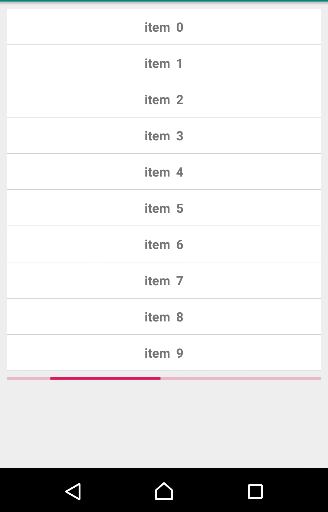

# KAdapter

 **K**otlin **A**dapter is a basic quick adapter for RecyclerView .

##  Motivation

KAdapter was built as learning purposes and engaging in open source .

## Install
- Add jitpack in your root build.gradle at the end of repositories:
```
allprojects {
		repositories {
			...
			maven { url 'https://jitpack.io' }
		}
	}
```
- Add the dependency
```
dependencies {
		implementation 'com.github.mahmoud-assaf:KAdapter:0.4'
	}
```

### Features

	 - Quick setup.
	 - Support multible views .
	 - Support item view click and long click.
	 - Support swiping actions .
	 - Load more data on demand or endless scrolling .
	 - Default and custom item decorations .
	 - Support Item selection .
	 - Different layout managers (vertical and horizontal Linear,Grid,Staggered ,flexible spans ).

### Usage
**Initialize :**
```
	var data :ArrayList<Any> //ur data 
	var adapter=KAdapter() // optional KAdapter.Defaults() for fine customization ,see below
```
**Define ur item views**
```
//add ur item views layouts 
adapter.addViewType(Model1::class to R.layout.model1_item_view)  //Pair<KClass,Int>
	.addViewType(Model2::class to R.layout.model2_item_view)  
	.addViewType(Model3::class to R.layout.model3_item_view)
```
**Bind views :**
```
	//binding views (those lambdas are invoked inside onBindViewHolder()
	//so make sure u keep views state like checkboxs for example as the view will be recycled upon 		scrolling
	//Pair<viewId:Int,bindingLambda:(view: View?, item: Any, position: Int) -> Unit>
	.bind(R.id.model1_title_txtview to {view, item, position ->  
		 view as TextView  //cast view
		 item as Model1  //cast item
		 view.text=item.title  //bind or apply ur action
	})

```
```
	.bind(R.id.model2_imageView to {view, item, position ->  
		 view as ImageView  
		 item as Model2  
		 //make sure the view state reflected of the actual item state in dataset
		 view.setImageResource(item.imageResId)  
			view.setOnClickListener {  
				  (data.get(position) as Model2).imageResId=R.drawable.image2 // <--  
				   view.setImageResource(R.drawable.image2)  
			 }  
	})
```
```
	.bind(R.id.model2_time_textView to {view, item, position ->  
		view as TextView  
		 item as Model2  
		 view.text=convertLongToTime(item.timeStamp)  
		 view.setOnClickListener {  
			  //getting a view in same row item by id , like edittext or seekbar or checkbox or anyview  
			 val remindcheckBox=adapter.getViewByIdAt(R.id.model2_remind_checkBox,position) as CheckBox  
			 val isChecked=remindcheckBox.isChecked  
			  Toast.makeText(this,"checkbox at this position is $isChecked",Toast.LENGTH_SHORT).show()  
		 }})
```
**Or define as Lambda :**
```
	//u can define ur lambda as (view: View?, item: Any, position: Int) -> Unit and assign it
	val checkboxBind= { chckbox: View?, item: Any, position: Int ->  
	item as Model3
	chckbox as CheckBox
	......
	.......
	}
	.bind(R.id.model3_checkBox to checkboxBind)
```
**Attach RecyclerView**
```
	//attach to recyclerview
	.attachTo(rv)
```
**Item decoration and divider :** should be called after attaching to recyclerview
```
	.withItemDecoration(itemDecoration: RecyclerView.ItemDecoration? = null) 
	//default decoration 	,optional RecyclerView.ItemDecoration will be applied if passed
	.withDivider(divider: DividerItemDecoration? = null) 
	 //default divider ,optional DividerItemDecoration will be applied if passed
```
Item decoration and dividers ,see customization below <br>


**Click Actions :**
```
	//on item click , ur lambda will be invoked on clicked position
	.onClick {  
		//  Toast.makeText(this," position $it clicked",Toast.LENGTH_SHORT).show()    
		}  
				
	//on item long click , ur lambda will be invoked on long clicked position
	.onLongClick {  
		 Toast.makeText(this," position $it long clicked",Toast.LENGTH_SHORT).show()  
  		}
```
**Swiping Action :** should be called after attaching to recyclerview
```
	//on swipe action , ur lambda will be invoked on position of swiping
	and direction of swiping ,u can customize further in Defaults ,see below
	.onSwipe { position, direction ->  
		    var dir = if (direction == ItemTouchHelper.LEFT) "left" else "right"  
			 Toast.makeText(this, "swiped item $position to $dir", Toast.LENGTH_SHORT).show()
			 /*data.removeAt(position)  
			adapter.notifyItemRemoved(position)  
			adapter.notifyItemRangeChanged(position, adapter.getItemCount()) */
		}
```
Swiping text ,can be customized ,see below  <br>


**Load More data , endless scrolling :** should be set before setting dataset
```

	.onLoadMore {      //<-- last position of data , so u we should get data starting from it+1  
			 if (adapter.itemCount>30) {  
			     adapter.resetLoadMore(0)  
			      //passing 0 will not trigger next onLoadMore()  
			}else{  
		               var newData=getMoreData(it)  
			        data.addAll(newData)  
		                adapter.resetLoadMore(newData.size)    // otherwise pass the new added
		                data size , no need to use any notify*** on adapter  
				 } 
		  }
```

Loading more data, progressview can be  customized ,see below  <br>



**Set dataset :**
```
	  //and set data
	 .setData(data)
```
**Item marking ,highlighting ,selection :** should be called after attaching to recyclerview
```
	 //marking(selecting) item
	 adapter.markItemAt(position)
	 //unmark 
	 adapter.unMarkItemAt(position)
	 //get marked items positions
	getMarkedPositions(): ArrayList<Int>

```  

**Layout :**  should be called after attaching to recyclerview
```
	 .asVertical()   //default layout manager
	 //.asHorizontal()
	 //.asGrid(numOfColumns: Int? = 0)  //optional numOfColumns or will be calculated 
	 automatically according to screen width (160 dp per cell width)
	 //.asHorizontalGrid(numOfRows: Int)
	 //.asStaggered(numOfColumns: Int? = 0)
	  //.asHorizontalStaggered(numOfRows: Int)
```
**Need quick simple String list ?**
```
var simpleAdapter=KAdapter().simpleAdapter()
//no binding just set data
.setData(data)  //ArrayList<String>
//all other features supported (decoration ,swiping,selection ,loadmore ,click ,longclick ...)
```
Simple Llist of Strings  <br>


**-Customization** 
KAdapter() class constructor can receive optional Defaults() object that allows u to fine customize some features
```
var defaults=Defaults(
//------------decoration --------------------  
 decorationColor = Color.GRAY,  //Int color of item decoration
decorationStrokeWidth=2,  //int dp of stroke width
decorationCornersRadius=10f,  //float decoration radius
//-----------------onloadMore--------------------------------  
loadMoreDummyViewResId = R.layout.loading_view,  
loadMoreThreshold = 0,  //threshold of triggering ur onLodMore ie:triggered on position=lastposition-threshold
//-----swiping------------------------  
swipeDirs=(ItemTouchHelper.RIGHT or ItemTouchHelper.LEFT),  //available swiping directions
swipeBackgroundColorLeft = Color.parseColor("#FFFFFF"),  //backgroundcolor
swipeTextLeft:String?="Delete",  
swipeTextLeftColor=Color.parseColor("#000000"),   swipeTextLeftSize=18,  //size in sp
swipeTextLeftTypeface=Typeface.DEFAULT,  //font TypeFace
swipeTextLeftMargin=10,   //margin in dp from start of child view
swipeBackgroundColorRight= Color.parseColor("#FFFFFF"),  
 swipeTextRight=null,  
swipeTextRightColor=Color.parseColor("#000000"),  
swipeTextRightSize=18,  
swipeTextRightTypeface=Typeface.DEFAULT,  
swipeTextRightMargin=10,  
swipeLeftDrawable=null,  
swipeRightDrawable=null,  
//---------marking------------------------------------------  
markedItemStrokeWidth=3,  //selection decoration stroke width in dp
markedItemStrokeColor=Color.BLACK //selection decoration stroke color
)
adapter=KAdapter(defaults)
```
##  License
[Apache 2](https://www.apache.org/licenses/LICENSE-2.0)
